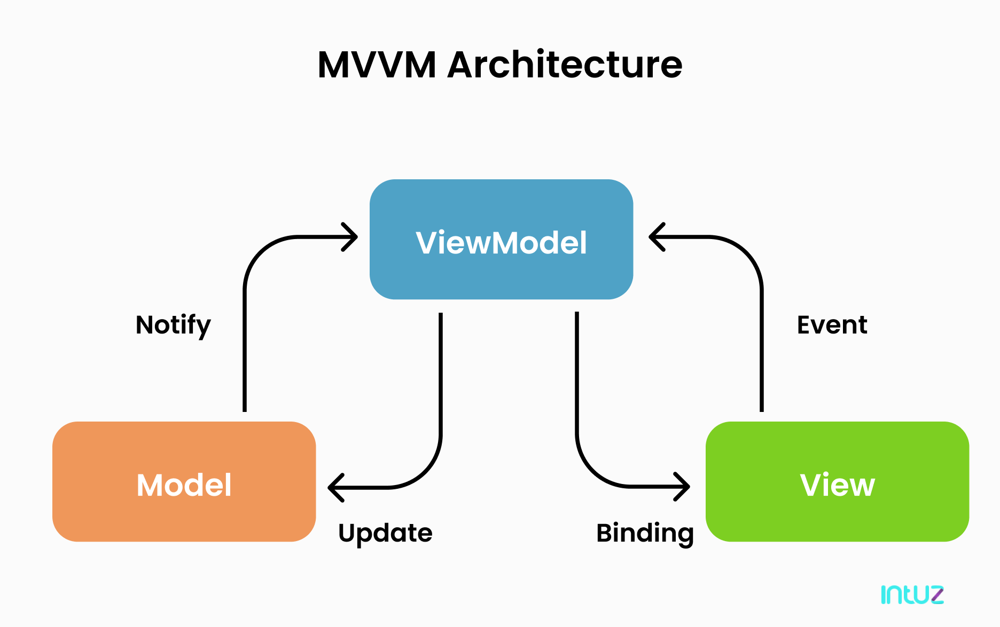

  

# Asaver 📱

/badge.svg)

_**Asaver Android application**_ is built with _Modern Android application development_ tools or libraries. 
Aim of this project is to showcase Good practice implementation of Android application development with proper architecture design. 
_Dedicated to all Android Developers with_ ❤️.

***You can Install and test latest NotyKT app from below 👇***

## Features  👓

- [x] Supports Fast Downloading for devices upto Android 9.
- [x] Supports 11 Short video Platforms.
- [x] View or Download Instagram Stories Privately.
- [x] Clean and Simple Material UI 🎨
- [x] Dark mode 🌗
- [ ] Tests ***(WIP)***

## About this project 💡

App to download videos of Short video platforms like Roposo, Tik Tok, ShareChat, etc. It currently supports 11 apps. It also supports Instagram Post Downloads, Reels downloads and IGTV Videos download. You can also see stories of your Instagram  Followers privately.

In Android Studio, just run the application as you want with any one of the module from above.

## Development Setup 🖥

You will require Android Studio 4.0 or newer to be able to build the app. Download latest Stable release from [here](https://developer.android.com/studio?gclsrc=ds&gclsrc=ds&gclid=CLqL6o-S3fMCFSzEhAAdt-oIqQ#downloads).

#### 🌙 Dark Mode

  
   
  
  

## Built with 🛠

- [Kotlin](https://kotlinlang.org/) - First class and official programming language for Android development.
- [Coroutines](https://kotlinlang.org/docs/reference/coroutines-overview.html) - For asynchronous and more..
- [State Flow](https://kotlin.github.io/kotlinx.coroutines/kotlinx-coroutines-core/kotlinx.coroutines.flow/-state-flow/) - A hot asynchronous data stream that represents a read-only state with a single updatable data value that emits updates to the value to its collectors.
- [Android Architecture Components](https://developer.android.com/topic/libraries/architecture) - Collection of libraries that help you design robust, testable, and maintainable apps.
  - [LiveData](https://developer.android.com/topic/libraries/architecture/livedata) - Data objects that notify views when the underlying database changes.
  - [ViewModel](https://developer.android.com/topic/libraries/architecture/viewmodel) - Stores UI-related data that isn't destroyed on UI changes. 
  - [ViewBinding](https://developer.android.com/topic/libraries/view-binding) - Generates a binding class for each XML layout file present in that module and allows you to more easily write code that interacts with views.
  - [WorkManager](https://developer.android.com/topic/libraries/architecture/workmanager) - WorkManager is an API that makes it easy to schedule deferrable, asynchronous tasks that are expected to run even if the app exits or the device restarts.
- [Dependency Injection](https://developer.android.com/training/dependency-injection) - 
  - [Hilt-Dagger](https://dagger.dev/hilt/) - Standard library to incorporate Dagger dependency injection into an Android application.
  - [Hilt-ViewModel](https://developer.android.com/training/dependency-injection/hilt-jetpack) - DI for injecting `ViewModel`.
  - [Hilt-WorkManager](https://developer.android.com/training/dependency-injection/hilt-jetpack) - DI for injecting `WorkManager`.
  - [Assisted Inject with Dagger](https://github.com/square/AssistedInject) - Manually injected dependencies for your JSR 330 configuration.
- [Retrofit](https://square.github.io/retrofit/) - A type-safe HTTP client for Android and Java.
- [Gson](https://github.com/google/gson) - A Java library that can be used to convert Java or Kotlin Objects into their JSON representation.
- [Gson Converter](https://github.com/square/retrofit/tree/master/retrofit-converters/moshi) - A Converter which uses Gson for serialization to and from JSON.
- [Material Components for Android](https://github.com/material-components/material-components-android) - Modular and customizable Material Design UI components for Android.

## Architecture

This app uses [_**MVVM (Model View View-Model)**_](https://developer.android.com/jetpack/docs/guide#recommended-app-arch) architecture.

